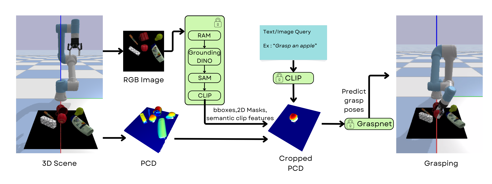

# Multi-Modal Open-Vocabulary Grasping
Object grasping in robotics is inherently challenging due to the need for higher-level understanding. Instead of relying on basic commands like "grasp object at Pose X," robots must interpret more complex instructions, such as "grasp the apple." Moreover, these systems should not be confined to a fixed set of objects seen during training; they must be capable of operating in an open-vocabulary manner. By incorporating multi-modal capabilities, robots can engage with humans more dynamically, accepting inputs such as text, images, and audio. This project, Multi-Modal Open-Vocabulary Grasping, integrates foundational models for scene understanding with Graspnet for grasp prediction, allows robots to interact intelligently and flexibly with their environment, respond to high-level queries, and enhance human-robot interaction in dynamic environments.

<div align="center">
  
</div>


## Installation Guide

Install all required dependencies and set up the environment for this project in the specified order to avoid conflicts by following the steps below.

### **Step 1: Install Dependencies**

```bash
pip install numpy==1.26.4
pip install torch==2.5.1 torchvision==0.20.1 torchaudio==2.5.1 --index-url https://download.pytorch.org/whl/cu124
pip install open_clip_torch
```

### **Step 2: Clone the Repository**

```bash
git clone https://github.com/arunmadhusud/Open-Vocabulary-Multi-Modal-Robotic-Grasping.git
cd Open-Vocabulary-Multi-Modal-Robotic-Grasping
```

### **Step 3: Install Grounded Segment Anything**

```bash
git clone https://github.com/IDEA-Research/Grounded-Segment-Anything.git
cd Grounded-Segment-Anything
git checkout a4d76a2
pip install -v --no-build-isolation -e GroundingDINO
export AM_I_DOCKER=False
export BUILD_WITH_CUDA=True
export CUDA_HOME=/usr/local/cuda
python -m pip install -e segment_anything
pip install -v --no-build-isolation -e GroundingDINO
pip install diffusers[torch]
git clone https://github.com/xinyu1205/recognize-anything.git
pip install -r ./recognize-anything/requirements.txt
pip install -e ./recognize-anything/
pip install supervision==0.21.0
```

### **Step 5: Download Model Weights**

```bash
git submodule init
git submodule update
wget https://dl.fbaipublicfiles.com/segment_anything/sam_vit_h_4b8939.pth
wget https://github.com/IDEA-Research/GroundingDINO/releases/download/v0.1.0-alpha/groundingdino_swint_ogc.pth
wget https://huggingface.co/spaces/xinyu1205/Tag2Text/resolve/main/ram_swin_large_14m.pth
```

### **Step 6: Install GraspNet**

```bash
cd ..
cd models/graspnet/pointnet2
python setup.py install
cd ../knn
python setup.py install
export SKLEARN_ALLOW_DEPRECATED_SKLEARN_PACKAGE_INSTALL=True
cd ../../..
git clone https://github.com/arunmadhusud/graspnetAPI.git
cd graspnetAPI
pip install .
cd ..
```

### **Step 7: Install Additional Dependencies**
```bash
pip install -U pybullet
pip install open3d
pip install open3d-plus
```

### **Step 8: For Google Colab (Optional)**
If running on Google Colab, set the required environment variables before installation:

```bash
import os

os.environ["AM_I_DOCKER"] = "False"
os.environ["BUILD_WITH_CUDA"] = "True"
os.environ["CUDA_HOME"] = "/usr/local/cuda"
os.environ["SKLEARN_ALLOW_DEPRECATED_SKLEARN_PACKAGE_INSTALL"] = "True"
```

## Assets

Download the processed object models from this [link](https://drive.google.com/file/d/1) and copy the contents to the `assets` directory as shown below:

```bash
OPEN-VOCABULARY-MULTI-MODAL-ROBOTIC-GRASPING
│
├── assets
│   ├── simlified_objects
```

## Usage

To run the project on your dataset with the default settings (GUI enabled), execute the following command:

```bash
python sim_test.py --testing_file 'PATH TO YOUR TESTING FILE'
```
To disable the GUI, use:

```bash
python sim_test.py --testing_file 'PATH TO YOUR TESTING FILE' --gui False
```

Example usage:

```bash
python sim_test.py --testing_file testing_cases/new_set_224_2.txt --gui False
```
Once the scene is processed using Grounded Segment Anything, you can interact with the robot using a text query or an image query through the command-line interface. For text queries, simply enter your query when prompted.For image queries, provide the absolute path to your image file as input.

## Demos


## Acknowledgements

I would like to thank the authors for their valuable contributions to these repositories and appreciate their efforts in open-sourcing their work:

- [Conceptgraphs](https://github.com/concept-graphs/concept-graphs.git)
- [Vision-Language-Grasping ](https://github.com/xukechun/Vision-Language-Grasping.git)
- [ThinkGrasp ](https://github.com/H-Freax/ThinkGrasp.git)
- [Grounded Segment Anything](https://github.com/IDEA-Research/Grounded-Segment-Anything.git)
- [open_clip] (https://github.com/mlfoundations/open_clip.git)

