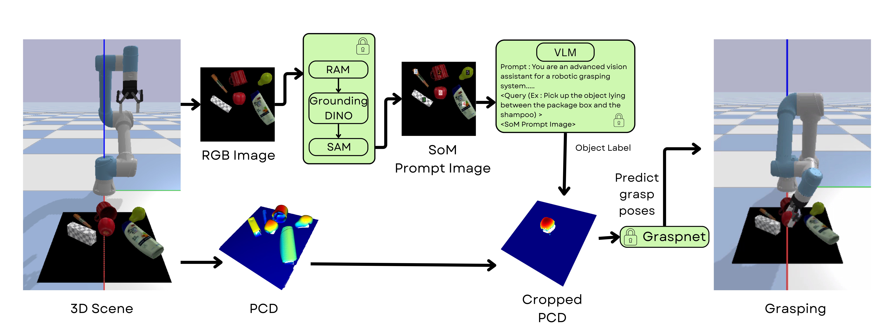
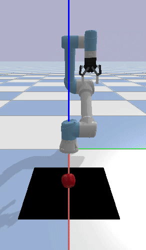
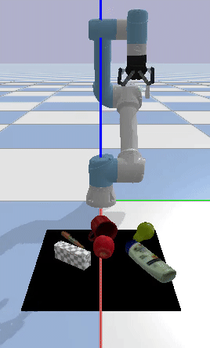
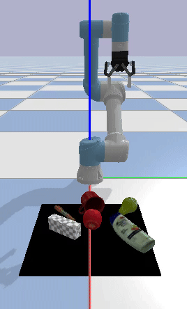
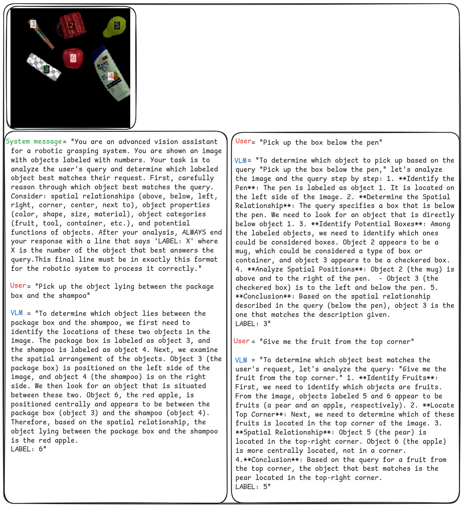

# Multi-Modal Open-Vocabulary Grasping
Object grasping in robotics is inherently challenging due to the need for higher-level understanding. Instead of relying on basic commands like *"Give me the object at Pose X"*, robots must interpret more complex instructions, such as *"Give me an apple"*.  Moreover, these systems should not be confined to a fixed set of objects seen during training; they must be capable of operating in an **open-vocabulary manner**.This project, **Multi-Modal Open-Vocabulary Grasping**, integrates **foundational models** for scene understanding with **GraspNet** for grasp prediction, enabling robots to interact more intelligently and flexibly with their surroundings.  By incorporating **multi-modal capabilities**, this system allows robots to understand and respond to diverse input modalities—including **text and images**—enhancing human-robot interaction and adaptability in dynamic environments. 

### System Overview

This project originally used CLIP for object grounding within a multi-modal pipeline. The scene image was processed using RAM, Grounding DINO, and SAM to generate object masks, and CLIP was used to retrieve the relevant object based on user queries.

<div align="center">
  
  <p><em>Figure 1: Original Multi-Modal Open-Vocabulary Grasping pipeline using CLIP</em></p>
</div>

The pipeline has since been upgraded to a more sophisticated approach that replaces CLIP with **Set of Mark (SoM) prompting**, leveraging the reasoning capabilities of powerful **Vision-Language Models (VLMs)** such as **GPT-4V** and **LLaMA 4 Scout**.

In this enhanced setup:
- The scene image is processed using **RAM, Grounding DINO, and SAM** to extract fine-grained object masks in an open-vocabulary fashion.
- These masks are used to generate **mask-labeled images**.
- A **VLM** then reasons over the marked image using the user's query and retrieves the most relevant object, enabling better spatial understanding and more accurate object identification—even from complex natural language queries. I have used **LLaMA 4 Scout** (currently accessed via Groq cloud) for this purpose, but any VLM can be integrated into the pipeline.


<div align="center">
  
  <p><em>Figure 2: Enhanced pipeline using Set of Mark (SoM) prompting and LLaMA 4 Scout</em></p>
</div>


## Installation Guide

Install all required dependencies and set up the environment for this project in the specified order to avoid conflicts by following the steps below.

### **Step 1: Install Dependencies**

```bash
pip install numpy==1.26.4
pip install torch==2.5.1 torchvision==0.20.1 torchaudio==2.5.1 --index-url https://download.pytorch.org/whl/cu124
pip install open_clip_torch   # Only for CLIP-based approach
pip install groq              # Only for SoM-based approach (used Groq Cloud API for LLaMA 4 Scout; can be replaced with any model/API provider)
```

### **Step 2: Clone the Repository**

```bash
git clone https://github.com/arunmadhusud/Open-Vocabulary-Multi-Modal-Robotic-Grasping.git
cd Open-Vocabulary-Multi-Modal-Robotic-Grasping
```

### **Step 3: Install Grounded Segment Anything**

```bash
git clone https://github.com/IDEA-Research/Grounded-Segment-Anything.git
cd Grounded-Segment-Anything
git checkout a4d76a2
pip install -v --no-build-isolation -e GroundingDINO
export AM_I_DOCKER=False
export BUILD_WITH_CUDA=True
export CUDA_HOME=/usr/local/cuda
python -m pip install -e segment_anything
pip install -v --no-build-isolation -e GroundingDINO
pip install diffusers[torch]
git clone https://github.com/xinyu1205/recognize-anything.git
pip install -r ./recognize-anything/requirements.txt
pip install -e ./recognize-anything/
pip install supervision==0.21.0
```

### **Step 4: Download Model Weights**

```bash
git submodule init
git submodule update
wget https://dl.fbaipublicfiles.com/segment_anything/sam_vit_h_4b8939.pth
wget https://github.com/IDEA-Research/GroundingDINO/releases/download/v0.1.0-alpha/groundingdino_swint_ogc.pth
wget https://huggingface.co/spaces/xinyu1205/Tag2Text/resolve/main/ram_swin_large_14m.pth
```

### **Step 5: Install GraspNet**

```bash
cd ..
cd models/graspnet/pointnet2
python setup.py install
cd ../knn
python setup.py install
export SKLEARN_ALLOW_DEPRECATED_SKLEARN_PACKAGE_INSTALL=True
cd ../../..
git clone https://github.com/arunmadhusud/graspnetAPI.git
cd graspnetAPI
pip install .
cd ..
```

### **Step 6: Install Additional Dependencies**
```bash
pip install -U pybullet
pip install open3d
pip install open3d-plus
```

### **Step 7: For Google Colab (Optional)**
If running on Google Colab, set the required environment variables before installation:

```bash
import os

os.environ["AM_I_DOCKER"] = "False"
os.environ["BUILD_WITH_CUDA"] = "True"
os.environ["CUDA_HOME"] = "/usr/local/cuda"
os.environ["SKLEARN_ALLOW_DEPRECATED_SKLEARN_PACKAGE_INSTALL"] = "True"
```

## Assets

Download the processed object models from this [link](https://drive.google.com/drive/u/1/folders/1ujsTs2nX79I77kNzs1GpHQbyE0GPVCBq) and copy the contents to the `assets` directory as shown below:

```bash
OPEN-VOCABULARY-MULTI-MODAL-ROBOTIC-GRASPING
│
├── assets
│   ├── simlified_objects
```

## Usage

To run the project on your dataset with the default settings (GUI enabled and using CLIP), execute the following command:

```bash
python sim_test.py --testing_file 'PATH TO YOUR TESTING FILE'
```
To disable the GUI, use:

```bash
python sim_test.py --testing_file 'PATH TO YOUR TESTING FILE' --gui False
```

To use Set of Mark (SoM) prompting, include the --som flag and specify the path to the config file where your Groq API key is stored:

```bash
python sim_test.py --testing_file 'PATH TO YOUR TESTING FILE' --som --config 'PATH TO YOUR CONFIG FILE'
```

Example usage:

```bash
python sim_test.py --testing_file testing_cases/new_set_224_2.txt --gui False --som --config config.yaml
```
Once the scene is processed using Grounded Segment Anything, you can interact with the robot using a text query or an image query through the command-line interface. For text queries, simply enter your query when prompted.For image queries, provide the absolute path to your image file as input.

Note: SoM supports only text queries as of now

## Demos


### Text Queries (using CLIP)

|  |  |  |
|:--:|:--:|:--:|
|"Give me an apple"|"Pick a bathroom essential"|"Find me a pear"|
|  |  |  |
|"Click"|"Find fruit for my lunch"|"I need a product to clean my face"|

### Image Query (using CLIP)

|  |  |
|:--:|:--:|
|"Query Image"|"Matched Result: Shampoo"|

### Set of Mark Prompts
|  |  |  |
|:--:|:--:|:--:|
|"Pick up the object lying between <br> the package box and the shampoo"|"Pick up the box below the pen"|"Give me the fruit from the top corner"|

### VLM Response in SoM 
|  |


## Acknowledgements

I would like to thank the authors for their valuable contributions to these repositories and appreciate their efforts in open-sourcing their work:

- [Conceptgraphs](https://github.com/concept-graphs/concept-graphs.git)
- [Vision-Language-Grasping ](https://github.com/xukechun/Vision-Language-Grasping.git)
- [ThinkGrasp ](https://github.com/H-Freax/ThinkGrasp.git)
- [Grounded Segment Anything](https://github.com/IDEA-Research/Grounded-Segment-Anything.git)
- [Open_clip](https://github.com/mlfoundations/open_clip.git)
- [GraspnetAPI](https://github.com/graspnet/graspnetAPI)
- [Set-of-Mark Prompting](https://som-gpt4v.github.io)

